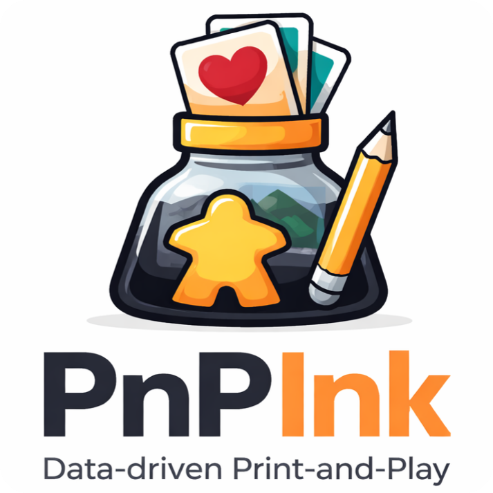

# PnPInk

PnPInk is a free, open-source, cross-platform toolkit for creating high-quality print-and-play materials for board games (cards, boards, tokens, tiles, and more) directly inside Inkscape.

It is a native extension suite that turns Inkscape into a complete publishing environment, accompanying creators from their first prototypes to final professional print compositions.

PnPInk automates the creation of card decks, boards, and punchboards, including hex or square grids, player sheets, counters, and tiles.

It combines Inkscape's full graphic power (gradients, filters, paths, symbols, and layers) with a visual GUI and a data-driven workflow (Google Sheets or CSV), producing editable, print-ready layouts with pixel-precise results.

PnPInk also includes a simple but powerful DSL (domain-specific language) that enables advanced layouts without complex scripting.

The key workflow is iterative: update the template or dataset parameters, re-run composition, and get refreshed layouts in seconds.

The DSL is designed to match how designers think, not how programmers write code: compact notation, visual intent first, and minimal cognitive load.

 

## Key Principles

1. `Open Source`: fully transparent, community-driven, and free to use.
2. `Cross-Platform`: works on Windows, macOS, and Linux.
3. `Non-Destructive`: everything remains fully editable SVG; nothing is baked or lost.
4. `Accessible & Visual`: no programming required; GUI-based and intuitive.
5. `Full Production Pipeline`: supports the full cycle, from quick prototypes to open distribution (PDF) and online sharing.

## Features

- Fast data-driven generation from CSV or Google Sheets.
- Placeholder-driven templates: map dataset columns to SVG IDs and regenerate entire sets instantly.
- Precise `Fit` + `Anchor` controls for predictable placement and scaling inside target frames.
- Front/back workflows (`@back`) for duplex cards and mirrored layouts.
- Built-in bleed and margin controls for print-safe compositions.
- Cutting and registration marks (`Marks`) generated directly from layout logic.
- Reusable presets for page, grid, and component sizing.
- Inline text icons: type icon names in text flow and render vector icons in-place.
- Source catalogs: resolve assets by name from the dataset, including large free libraries (200K+ icons and 2M+ images, depending on source).
- Spritesheet workflows for atlas-based assets and high-volume content pipelines.
- Fully editable SVG output after generation, not flattened exports.
- Native Inkscape workflow: design, compose, iterate, and export without leaving the editor.

One template and one dataset can produce hundreds of print-ready components in seconds, and every generated piece remains editable.

## Installation (Quick)

1. Install Inkscape.
2. Download the latest PnPInk ZIP from `Releases`.
3. Extract the ZIP.
4. Run:
   - Windows: `install_windows.bat`
   - macOS/Linux: `chmod +x install.sh && ./install.sh`
   - Any OS: `python install.py` (or `python3 install.py`)
5. Restart Inkscape and confirm `Extensions > PnPInk ...` appears.

## First Recommended Run

1. Build a template SVG with IDs (`title`, `cost`, `art`, etc.).
2. Prepare a CSV/Sheet with matching columns.
3. Run DeckMaker from `Extensions > PnPInk ...`.
4. Regenerate as you iterate: tweak template or dataset settings, then compose again.

## Documentation

- Quickstart: [`docs/quickstart.md`](docs/quickstart.md)
- Introduction: [`docs/intro.md`](docs/intro.md)
- General manual: [`docs/pnpink-general.md`](docs/pnpink-general.md)

## Project Status

This repository is currently in `alpha` release stage.
Until stabilization is explicitly announced, DSL changes may break backward compatibility and older datasets/templates may require updates.
Join the community on the BGG Guild to follow progress, share use cases, and influence the roadmap:

- [`PnPInk BGG Guild`](https://boardgamegeek.com/guild/4569)

## Long-Term Roadmap

Potential long-term directions (no guarantees): deeper professional PDF workflows, a compact `ZVG/PNP` packaging format, exports for virtual tabletop platforms, and local AI-assisted bulk production tools.
