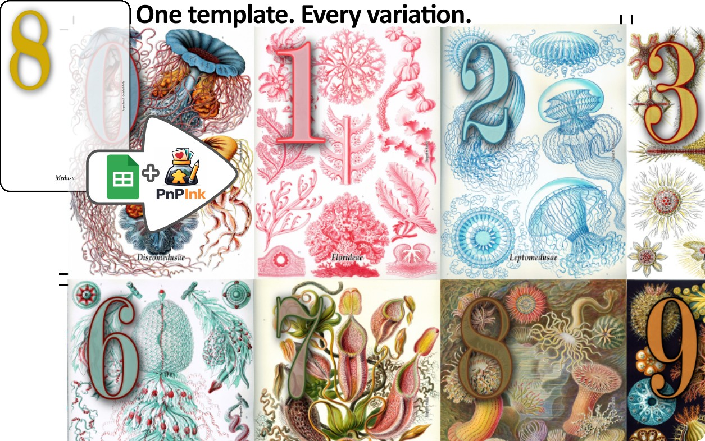

  

<h1 align="center">PnPInk</h1>

<strong>Design once. Generate cards, badges, labels, and dynamic PDFs.</strong>

  Connect Inkscape to Google Sheets or CSV and turn every row into finished artwork.

  
  
  
  

  <a href="https://github.com/xoellijo/pnpink/releases/latest"><strong>Install PnPInk</strong></a>
  ·
  <a href="https://xoellijo.github.io/pnpink/intro/"><strong>Read the documentation</strong></a>
  ·
  <a href="https://boardgamegeek.com/guild/4569"><strong>Join the community</strong></a>

---

## One Design, Hundreds of Variations

PnPInk connects **one Inkscape template** to **Google Sheets or CSV data**. Each row can become a card, badge, label, certificate, ticket, game component, or any other personalized graphic.

Design visually, connect text and graphics to your data, and generate a complete, print-ready batch in seconds. Change a name, replace a photo, rebalance a card, or redesign the template, then regenerate everything without rebuilding each item by hand.

  

<em>One SVG template, one dataset, and every card variation generated automatically. Click to see the complete output.</em>

Your output stays **real, editable SVG**. Nothing is locked into a proprietary format, and nothing is flattened until you choose to export.

| Design visually | Connect your content | Generate and publish |
| --- | --- | --- |
| Use the full creative power of Inkscape. | Drive every component from CSV or Google Sheets. | Create editable SVG, print-ready PDF, images, and cutting files. |

## What Can You Create?

- Card games, decks, and card backs
- Boards, modular maps, and large split boards
- Counters, tokens, tiles, and punchboards
- Hex grids, labels, standees, and reference sheets
- Prototypes for Cricut and Silhouette workflows
- Event badges, ID cards, credentials, and personalized passes
- Certificates, diplomas, tickets, invitations, and name tags
- Product labels, price cards, catalog sheets, and mail pieces
- High-volume variable-data publishing (VDP) and dynamic PDF batches

Whether you are testing ten prototype cards, preparing badges for an event, or producing thousands of personalized documents, the workflow stays the same.

## From Google Sheets to Dynamic PDFs

Keep names, text, numbers, image links, and other changing content in a shared spreadsheet. PnPInk combines each row with your Inkscape design and can produce editable SVG, print-ready PDF, images, and cutting files.

Use local artwork, reusable SVG symbols, Iconify icons, Wikimedia Commons images, public Google Drive files, spritesheets, or generated maps. The template controls the design; the spreadsheet controls what changes.

## Why PnPInk?

### Create, Don't Code

Build your design in Inkscape and use familiar IDs to connect artwork with data. No programming is required. PnPInk's compact DSL is there when you want advanced automation—not as a barrier to getting started.

### Change Everything in One Place

Update the spreadsheet to change names, values, or artwork. Update the SVG to redesign the layout. Regenerate the project and every item follows automatically.

### Keep Full Creative Control

Use paths, typography, layers, gradients, filters, symbols, masks, and every other tool available in Inkscape. Generated results remain editable and inspectable.

### Go from Prototype to Production

Start with a quick prototype or a short event list, then move to bleed, duplex printing, registration marks, professional PDF export, ICC profiles, or plotter-ready cutting templates when needed.

### Use Content from Anywhere

Place local files, reusable SVG symbols, Iconify icons, Wikimedia Commons images, public Google Drive folders, spritesheets, and generated SVG maps directly from your dataset.

### Stay Free and Independent

PnPInk is free, open source, cross-platform, and built around open formats. Your project remains yours.

## How It Works

1. **Design a template** in Inkscape using IDs such as `name`, `photo`, `title`, `art`, or `back_art`.
2. **Add your content** in CSV or Google Sheets using matching column names.
3. **Run DeckMaker** to generate, inspect, and export the complete project.

Then iterate: change the data or design and generate again.

## Made for Real Production Work

PnPInk grows with your project:

- Precise Fit + Anchor placement for predictable sizing and alignment
- Multiple icons and rich text inside the same field
- Automatic page layouts, grids, bleed, margins, and cutting marks
- Duplex front/back generation with mirrored print layouts
- Reusable page, card, layout, and export presets
- Portable `.pnp` and `.zvg` project packages
- SVG maps from OpenStreetMap and OpenFreeMap sources
- Large-output splitting and shared-resource optimization
- PDF presets, PDF/X CMYK, ICC profiles, and smart filter rasterization
- PNG, JPEG, TIFF, WebP, SVG, PS, EPS, EMF, WMF, and cutting exports
- High-throughput paths for demanding variable-data projects

Optimized templates can generate tens of thousands of records per minute on suitable hardware, while smaller projects benefit from the same repeatable workflow.

## Install PnPInk

### Requirements

- [Inkscape](https://inkscape.org/release/) 1.2 or newer
- Windows, macOS, or Linux
- A standard Inkscape installation; sandboxed builds such as Flatpak are not currently supported

### Installation

Download just one launcher from the [latest release](https://github.com/xoellijo/pnpink/releases/latest):

- Windows: run `pnpink_install.bat`. It installs a private portable Ghostscript only when none is available; use `--no-ghostscript` to skip this check.
- macOS/Linux: run `chmod +x pnpink_install.sh && ./pnpink_install.sh`.

The launchers remain stable and download the latest PnPInk release by default. To install a specific release using the new packaging scheme (`0.55` or newer), pass its version, for example `pnpink_install.bat 0.59`, `pnpink_install.bat --version 0.59`, or `./pnpink_install.sh 0.59`.

Restart Inkscape, then open `Extensions > PnPInk`.

## Your First Project

The fastest way to understand PnPInk is to generate something:

1. Open `Extensions > PnPInk > DeckMaker > About > Open examples folder`.
2. Choose one of the prepared `.pnp` projects or an SVG example with its CSV dataset.
3. Run DeckMaker and open the generated SVG.
4. Change a value or visual element and generate it again.

`.pnp` packages contain the template, dataset, manifest, and project assets, making them ideal for learning and sharing complete projects.

## Learn More

- [Introduction](https://xoellijo.github.io/pnpink/intro/) — understand the core workflow
- [Quick Start](https://xoellijo.github.io/pnpink/quickstart/) — build your first data-driven template
- [DeckMaker GUI](https://xoellijo.github.io/pnpink/deckmaker-gui/) — generation and project controls
- [Export](https://xoellijo.github.io/pnpink/export/) — PDF, images, cutting files, and production options
- [Fit and Anchor](https://xoellijo.github.io/pnpink/dsl/fit-anchor/) — precise visual placement
- [Full PDF guide](https://xoellijo.github.io/pnpink/pnpink.pdf) — offline documentation

## Project Status

PnPInk is currently in beta and has been tested with Inkscape 1.2 through 1.5 on Windows and Linux. The project is evolving quickly, so advanced DSL syntax may occasionally change before the stable release.

For production projects, keep a copy of the PnPInk version used to generate them.

## Community

Share projects, ask questions, suggest features, and help shape the roadmap in the [PnPInk BoardGameGeek Guild](https://boardgamegeek.com/guild/4569).

If PnPInk helps your project, consider giving the repository a ⭐. It makes the project easier for other creators to discover.

## Open Source

PnPInk is released under the [MIT License](LICENSE).

The project was inspired by [CounterSheets](https://github.com/lifelike/countersheetsextension) and continues that spirit of open, data-driven tabletop creation.
