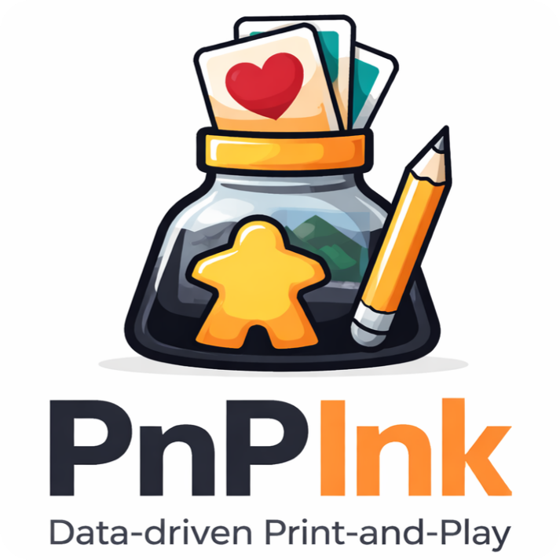

# PnPInk Documentation

PnPInk is an Inkscape extension suite for data-driven print-and-play production.

Start with [Basic Workflow](quickstart.md), then use [DeckMaker GUI](deckmaker-gui.md) for the current user interface and [Export](export.md) for PDF, PDF/X, and other output formats.
