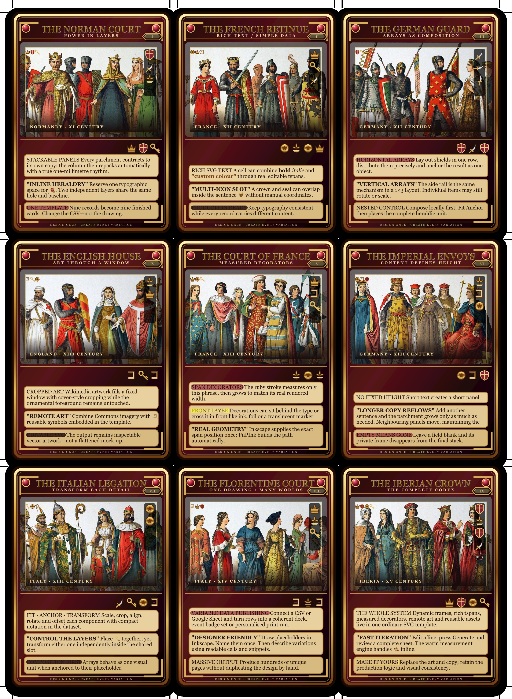

# The Gilded Codex

`medieval_showcase.svg` and `medieval_showcase.csv` form a nine-card PnPInk showcase designed to demonstrate a polished variable-data workflow rather than a flattened mock-up.

The template combines clipped Wikimedia Commons artwork, reusable vector symbols, horizontal and vertical icon arrays, layered inline icons, rich SVG text, measured text decorators, dynamic `shape-inside` frames and stackable layouts. The title uses an SVG specular-lighting filter to create a restrained engraved-gold effect.

Open `medieval_showcase.svg` with Deckmaker and generate the linked CSV. The first record defines an A4 `3x3` poker-card layout; the remaining rows inherit it.

## Artwork and licensing

The nine costume plates come from Albert Kretschmer and Carl Rohrbach's *Costumes of All Nations* (1882), via the [Medieval fashion collection on Wikimedia Commons](https://commons.wikimedia.org/wiki/Category:Medieval_fashion). The selected file pages identify the historical artwork as public domain. All auxiliary heraldry, frames and ornaments in this example are original SVG elements embedded in the template.

The SVG itself keeps the source references in the dataset so each card remains auditable and reproducible.
